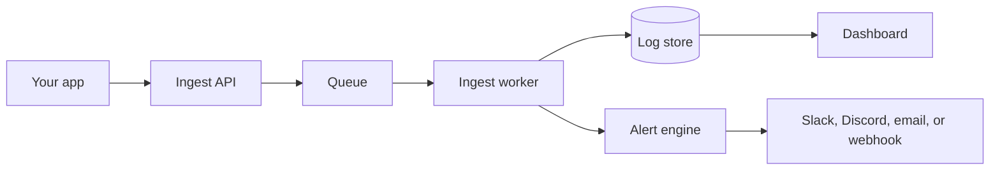

## Architecture

Every log you send follows the same path. Your SDK ships a batch to the ingest API, the
API queues it, a worker stores it, and that worker also feeds your live stream and
evaluates your alert rules.

### Ingest API

The public entry point for your logs. It authenticates your API key, checks that you are
within your plan's event quota, validates the batch, and returns. It never waits on
storage.

### Queue

A durable buffer between accepting a log and storing it. Because the ingest API only
enqueues, a traffic spike on your side is absorbed instead of turning into dropped events.

### Ingest worker

A background process that drains the queue. For each batch it writes the events to
storage, updates your event count, pushes the batch to live subscribers, and hands the
batch to the alert engine. A batch it fails to process is retried.

### Log store

Where your events live, partitioned by month and indexed by time. How long they stay
depends on your plan: 7 days on Free, 30 on Starter, 60 on Pro, 90 on Business.

### Alert engine

Evaluates every incoming batch against your active rules. A rule is a set of conditions
plus a threshold over a time window. When the threshold is crossed and the rule is not
already in its cooldown, the alert is delivered.

### Dashboard

Where you search stored events and watch the live stream. Queries are always bounded by
your plan's retention window.

## Design principles

### Your app never blocks

Sending a log is a fire-and-forget operation. The SDK buffers in memory and the API
enqueues rather than writes, so adding logging does not add latency to your requests.

### Nothing is lost once accepted

The API only acknowledges a batch after it is durably queued, and the worker retries
anything it fails to process. A network hiccup between your app and SnapLog is the one
place logs can be dropped.

### Isolation over completeness

Each piece of the pipeline works on its own. The queue would be pointless without a
worker, and the store would be pointless without a query path. That way you can reason
about a failure in one piece without unpicking the whole system.

### Portable, not proprietary

Logs are plain structured events over HTTPS, and alert webhooks are signed payloads you
can verify yourself. If you ever want to move off SnapLog, you already have the data and
the delivery contract.

## Next steps

<CardGroup cols={2}>
  <Card title="Quickstart" icon="rocket" href="/quickstart">
    Send your first log in 30 seconds
  </Card>
  <Card title="Overview" icon="book" href="/overview">
    Log structure, types, and importance levels
  </Card>
</CardGroup>
